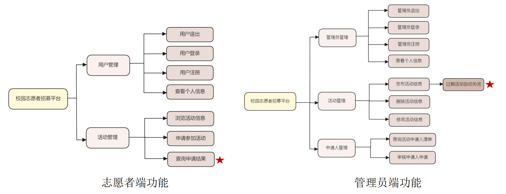
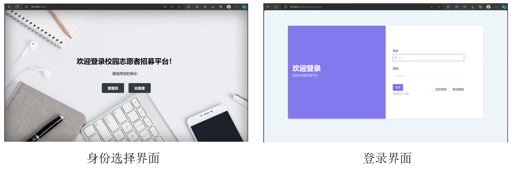
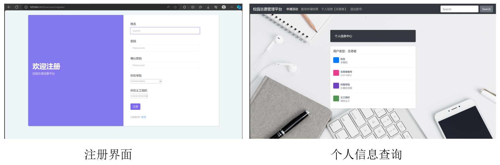
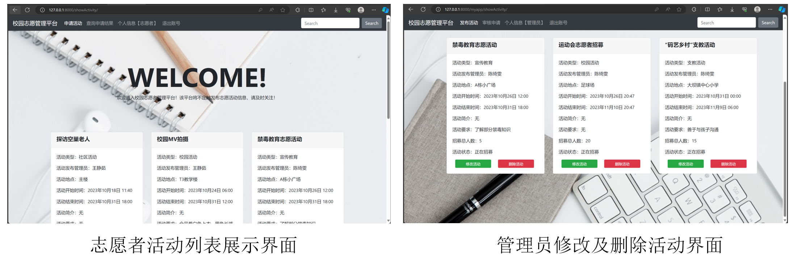
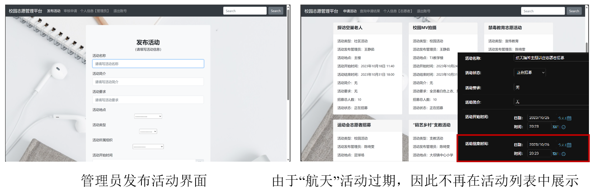
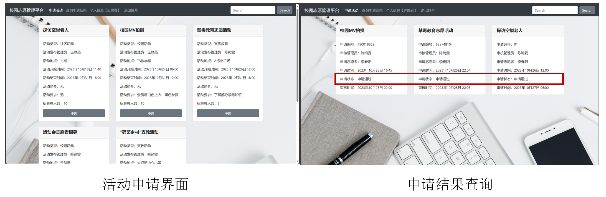
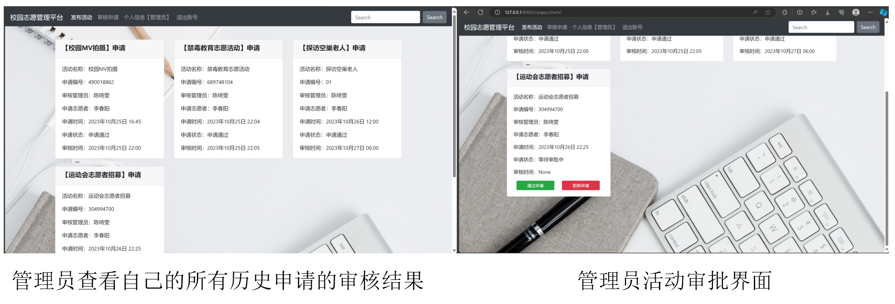
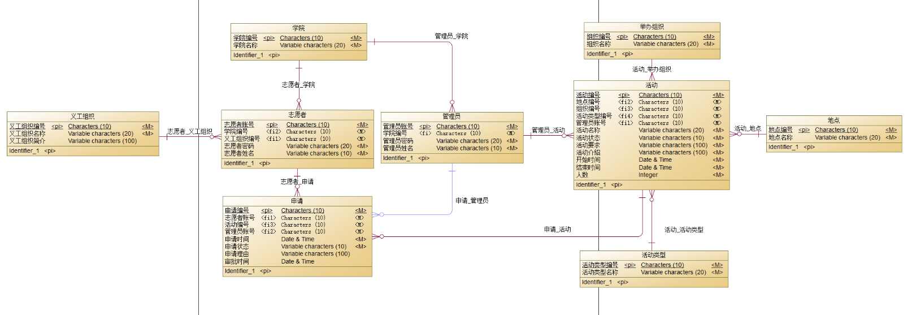
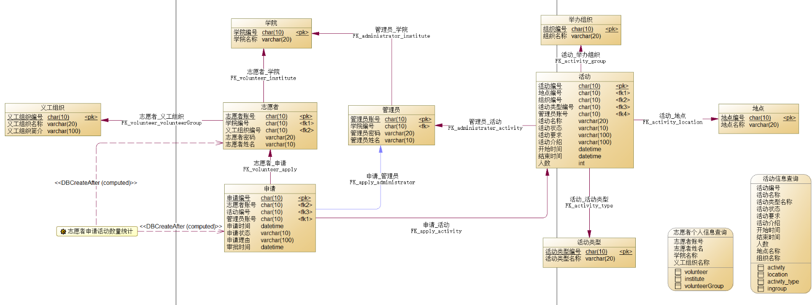

@author young

本项目为HITSZ数据库实验三（网页版）志愿者招募平台代码，本`README.md`节选自实验报告。

# 实验环境 

- 操作系统：Window 11 

- 数据库设计：PowerDesigner 
- 数据库管理系统：MySQL 
- 前后端交互方案：使用 Django 搭建 Web 应用 
- 前后端交互编程语言：Python 
- 前端开发所用的 IDE：PyCharm

# 实现功能



如果从整个系统的设计出发，不难看出，该校园志愿者招募平台的功能分为用户管理、活动管理和申请管理三大功能。

- **用户管理：** 

  该平台有志愿者和管理员这两种类型的用户。使用者可根据自身情况完成这两 种不同类型用户的**注册、登录、退出**操作，并可在平台中**查询**到自己的姓名、编号、义工组织（仅志愿者包含这一信息）、学院等个人信息。

  

  

- **活动管理：**

  管理员可**发布新的志愿活动**（包括活动名称、时间、地点、人数、要求、介绍等活动信息），也可以**修改和删除已有的志愿活动。**此外，系统的活动展示界面会根据活动的开始时间升序进行展示，并会**自动关闭已经过期的活动**（仅志愿者端不再显示，管理员端仍可以对已过期活动进行编辑）。

  

  

- **申请管理：**

  志愿者可以**申请参加**正处于招募状态的活动。志愿者提交申请后，管理员可**查看自己所发布活动的申请人清单，**并对申请人进行**审核**（通过或拒绝）。此外，志愿者可以**查看自己所有历史申请的审核结果**（待审核、通过还是拒绝状态）。

  

  

# 数据库设计

- ER图


- LDM图：



- PDM图：




# 项目运行

本地运行命令：

```python
python  manage.py runserver 
```

Django后台：

使用Django Admin可以快速对数据库的各个数据表进行增删查改。


其关联的数据库：


# 参考文章

[DB课程项目-校园食堂点餐系统-开发文档 | Hwcoder - Life Oriented Programming](https://hwcoder.top/DB-Project)

[一杯茶的时间，上手 Django 框架开发 - 知乎 (zhihu.com)](https://zhuanlan.zhihu.com/p/98788776)